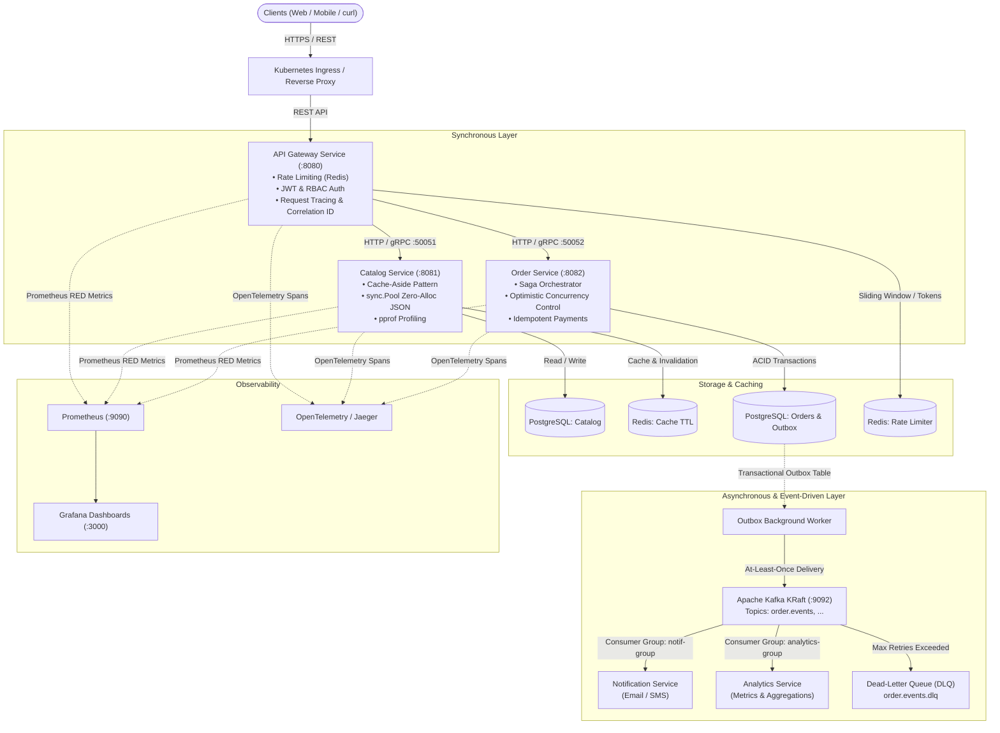

# Digital Commerce Platform 🛒🚀

A high-load, distributed e-commerce platform built with **Go (Golang)** adhering to **Clean Architecture**, **Microservices**, **Event-Driven Architecture (EDA)**, and **Production Readiness** best practices.

Designed and implemented as an architectural benchmark and hands-on portfolio platform demonstrating **Middle / Senior Go Backend Engineer** capabilities.

> 🇷🇺 *Русскоязычная версия документации доступна в [README.ru.md](README.ru.md).*

---

## 🏛 1. System Architecture

The platform is designed as an isolated, horizontally scalable microservice ecosystem with resilient failover strategies and clear architectural boundaries.

### System Interaction Diagram



---

## ⚖️ 2. Architectural Decisions & Trade-offs

Every key technical decision was chosen after weighing pros, cons, and alternatives:

| Decision Area | Chosen Solution | Alternative | Why This Approach (Trade-off) |
|---|---|---|---|
| **Distributed Consistency** | **Transactional Outbox + Saga Orchestrator** | 2PC (Two-Phase Commit / XA) | 2PC locks tables and worker threads awaiting cross-network consensus, severely reducing availability and creating a single point of failure. Outbox guarantees atomic event persistence within the local database transaction, while Saga orchestrates compensations (Eventual Consistency) without distributed locks. |
| **Inter-Service Communication** | **Hybrid: gRPC (Sync) + Kafka (Async)** | Pure REST or Pure Message Broker | Synchronous gRPC (HTTP/2 + Protobuf) is used for low-latency queries and strong contract guarantees. Kafka handles asynchronous side effects (notifications, analytics), removing temporal coupling between services. |
| **Catalog Caching** | **Cache-Aside (Lazy Loading) + Key Invalidation** | Write-Through / Refresh-Ahead | Cache-Aside avoids wasting Redis memory on "cold" products that are never queried. Invalidation on update (`rdb.Del`) guarantees stale cache eviction while keeping data-write paths simple. |
| **Concurrency Control** | **Optimistic Concurrency Control (OCC via `version` column)** | Pessimistic Locking (`SELECT ... FOR UPDATE`) | In high-read scenarios with occasional concurrent writes (e.g., user order status transitions), pessimistic locks cause database connection starvation. OCC checks `UPDATE ... WHERE version = $1` and signals a conflict without holding row locks. Pessimistic locks are reserved exclusively for critical payment clearance. |
| **Kafka Failure Handling** | **Exponential Backoff + DLQ + Manual Offset Commit** | Auto-commit / Infinite Retries | Auto-commit risks dropping messages on unhandled pod crashes. Infinite retries cause Head-of-Line blocking in the partition. We use manual offset commits only after successful processing or after routing poison pills to a Dead-Letter Queue (DLQ). |
| **Cascading Failure Protection** | **Circuit Breaker (Fail-Fast)** | Infinite Timeout / Unbounded Retry | When an upstream service degrades, uncontrolled retries trigger a thundering herd problem and exhaust goroutine pools. Circuit Breaker flips to `OPEN` and fails fast, giving the dependency time to recover. |
| **Hot Path Optimization** | **`sync.Pool` for JSON Serialization Buffers** | Standard `json.Marshal` | `json.Marshal` allocates a new byte slice on every request. Reusing pre-allocated `bytes.Buffer` instances via `sync.Pool` dramatically reduces GC pressure and allocations per operation on high-throughput endpoints like `GET /products`. |

---

## 🛠 3. Technology Stack

- **Backend:** Go 1.22+ (`net/http`, `google.golang.org/grpc`, `jackc/pgx/v5`, `go-redis/v9`, `segmentio/kafka-go`).
- **Data & Storage:** PostgreSQL 16, Redis 7 (Alpine), Apache Kafka 3.8 (KRaft mode without ZooKeeper).
- **Security:** JWT (HMAC-SHA256), Password Hashing (`golang.org/x/crypto/bcrypt`), Role-Based Access Control (`USER`, `ADMIN`).
- **Observability:** Prometheus, Grafana, OpenTelemetry, Structured Logging (`log/slog`).
- **DevOps & Cloud Native:** Docker (Multi-stage builds, non-root user `10001`), Docker Compose, Kubernetes (Deployments, Services, ConfigMaps, Secrets, Probes, HPA), GitHub Actions CI/CD.

---

## 🚀 4. Local Quickstart (Docker Compose)

### Prerequisites
- **Docker** (version 24.0+) and **Docker Compose** plugin (version 2.20+).
- `curl` and `git` (optional: `make`, `hey` or `wrk` for load benchmarking).

### Step 1. Clone the repository
```bash
git clone https://github.com/Nuriklan/digital-commerce.git
cd digital-commerce
```

### Step 2. Launch the entire platform
Build and start all containers in background mode:
```bash
docker compose up --build -d
```

### Step 3. Verify container status
Check that all services report a `healthy` status:
```bash
docker compose ps
```

You should see all platform services up and running:
- `digital_commerce_gateway` — API Gateway (port `:8080`)
- `digital_commerce_catalog` — Product Catalog (HTTP `:8081`, gRPC `:50051`)
- `digital_commerce_order` — Order & Payment Service (HTTP `:8082`, gRPC `:50052`)
- `digital_commerce_notification` — Kafka Notification Consumer
- `digital_commerce_analytics` — Kafka Analytics Consumer
- `digital_commerce_db` — PostgreSQL 16 (port `:5432`)
- `digital_commerce_redis` — Redis 7 (port `:6379`)
- `digital_commerce_kafka` — Apache Kafka KRaft (port `:9092`)
- `digital_commerce_prometheus` — Metrics Aggregation (port `:9090`)
- `digital_commerce_grafana` — Dashboard Visualization (port `:3000`)

---

## 🧪 5. Testing the API (cURL Examples)

### 1. Gateway Health Check
```bash
curl -i http://localhost:8080/health
```
*Expected response:* `HTTP/200 OK` with body `{"service":"gateway","status":"ok"}`.

### 2. User Registration
```bash
curl -i -X POST http://localhost:8080/auth/register \
  -H "Content-Type: application/json" \
  -d '{
    "name": "Jane Developer",
    "email": "jane@example.com",
    "password": "SecurePassword123!",
    "role": "USER"
  }'
```

### 3. User Login & JWT Retrieval
```bash
curl -i -X POST http://localhost:8080/auth/login \
  -H "Content-Type: application/json" \
  -d '{
    "email": "jane@example.com",
    "password": "SecurePassword123!"
  }'
```
*Copy the `token` string from the JSON response to use in authenticated headers.*

### 4. Admin Product Creation (RBAC Protection)
Register an administrator account (`"role": "ADMIN"`), obtain the token, and create a product:
```bash
curl -i -X POST http://localhost:8080/products \
  -H "Authorization: Bearer <ADMIN_JWT_TOKEN>" \
  -H "Content-Type: application/json" \
  -d '{
    "name": "Ergonomic Mechanical Keyboard",
    "price": 189.99
  }'
```

### 5. Fetching Products (Cached + Zero-Alloc JSON Response)
```bash
curl -i http://localhost:8080/products?limit=10&offset=0
```

### 6. Create Order & Process Idempotent Payment
```bash
# 1. Create order
curl -i -X POST http://localhost:8080/orders \
  -H "Authorization: Bearer <USER_JWT_TOKEN>" \
  -H "Content-Type: application/json" \
  -d '{
    "items": [
      {
        "product_id": "<PRODUCT_UUID>",
        "quantity": 1
      }
    ]
  }'

# 2. Pay with Idempotency-Key
curl -i -X POST http://localhost:8080/payments \
  -H "Idempotency-Key: payment-idempotency-token-123" \
  -H "Content-Type: application/json" \
  -d '{
    "order_id": "<ORDER_UUID>"
  }'
```
*Submitting the same `Idempotency-Key` again returns the cached response without double-charging.*

---

## 📊 6. Observability, Tracing & Profiling

- **Prometheus UI:** Available at [http://localhost:9090](http://localhost:9090).
  - Collects RED metrics: `digital_commerce_http_requests_total`, `digital_commerce_http_request_duration_seconds`.
- **Grafana:** Available at [http://localhost:3000](http://localhost:3000) (default credentials: `admin` / `admin`).
  - Pre-configured dashboards monitoring RPS, error rates, and p95/p99 latency percentiles.
- **Integrated pprof Profiling:**
  - On-demand CPU Profiling:
    ```bash
    go tool pprof http://localhost:8081/debug/pprof/profile?seconds=30
    ```
  - Heap & Memory Allocation Analysis:
    ```bash
    go tool pprof -http=:8085 http://localhost:8081/debug/pprof/heap
    ```

---

## 🧪 7. Running Tests Locally

Run unit, integration, and production readiness suites directly via the Go CLI:
```powershell
# Run all unit and integration tests
go test -v ./...

# Run the Production Readiness audit test suite
go test -v ./tests -run TestReadiness

# Run microbenchmarks for the catalog hot path
go test -v -bench=BenchmarkListProducts -benchmem ./internal/handler
```

---

## 🛑 8. Tearing Down the Environment

Stop all containers while preserving database and volume data:
```bash
docker compose down
```

To perform a complete clean wipe (including PostgreSQL volumes, Kafka data, and Redis cache):
```bash
docker compose down -v
```

---

## 📜 License
Distributed under the MIT License. Created for educational and benchmark purposes as part of the **Go Middle Backend Engineering Mastery Roadmap**.
