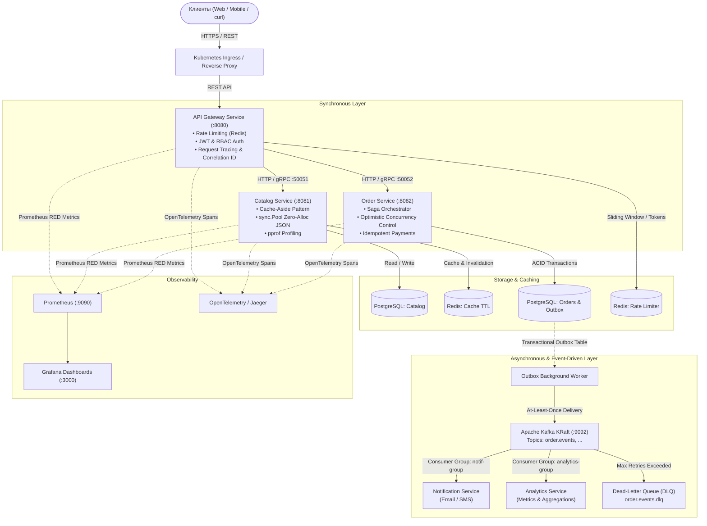

# Digital Commerce Platform 🛒🚀

Высоконагруженная, распределенная платформа электронной коммерции, разработанная на языке **Go (Golang)** в соответствии с практиками **Clean Architecture**, **Microservices**, **Event-Driven Architecture (EDA)** и **Production Readiness**.

Проект построен как боевой полигон и архитектурный эталон для подтверждения квалификации **Middle / Senior Go Backend Engineer**.

---

## 🏛 1. Архитектура системы

Платформа представляет собой распределенную микросервисную систему, спроектированную с учетом отказоустойчивости, изоляции сбоев и горизонтального масштабирования.

### Схема взаимодействия компонентов



---

## ⚖️ 2. Архитектурные решения и компромиссы (Engineering Trade-offs)

При проектировании платформы каждое техническое решение принималось на основе анализа преимуществ, недостатков и альтернатив:

| Решение | Выбранный подход | Альтернатива | Почему выбран этот подход (Trade-off) |
|---|---|---|---|
| **Распределенная согласованность** | **Transactional Outbox + Saga Orchestrator** | 2PC (Двухфазный коммит / XA) | 2PC блокирует таблицы и потоки в ожидании ответов по сети, снижает доступность системы и создает единую точку отказа. Outbox гарантирует сохранение события в одной локальной транзакции с заказом, а Saga компенсирует сбои (Eventual Consistency) без распределенных локов. |
| **Межсервисное взаимодействие** | **Гибрид: gRPC (синхронно) + Kafka (асинхронно)** | Чистый REST или только брокер сообщений | Синхронный gRPC (HTTP/2 + Protobuf) используется для критичных чтений и контрактов с низкой латентностью. Kafka используется для сайд-эффектов (уведомления, аналитика), устраняя жесткую временную связность (Temporal Coupling). |
| **Кэширование каталога** | **Cache-Aside (Lazy Loading) + Инвалидация по ключу** | Write-Through / Refresh-Ahead | Cache-Aside не расходует память Redis на «холодные» товары, которые никто не запрашивает. Инвалидация ключа (`rdb.Del`) при обновлении товара гарантирует сброс устаревших данных при сохранении простоты логики. |
| **Контроль конкурентности** | **Optimistic Concurrency Control (OCC, колонка `version`)** | Pessimistic Locking (`SELECT ... FOR UPDATE`) | В сценариях частых чтений и редких конфликтов (обновление статуса заказа пользователем) пессимистические блокировки создают ненужный contention в базе. OCC проверяет версию в `UPDATE ... WHERE version = $1` и сигнализирует о конфликте без удержания строчных блокировок. Пессимистический лок оставлен только для критичного клиринга платежей. |
| **Обработка сбоев в Kafka** | **Exponential Backoff + DLQ + Manual Offset Commit** | Auto-commit / Бесконечные ретраи | Автоматический коммит оффсетов приводит к потере сообщений при аварии пода. Бесконечные ретраи блокируют партицию (Head-of-Line Blocking). Мы используем ручной коммит после успешной обработки либо после маршрутизации ядовитого сообщения (Poison Pill) в DLQ. |
| **Предотвращение каскадных сбоев** | **Circuit Breaker (Fail-Fast)** | Бесконечный Timeout / Simple Retry | Если нижележащий сервис деградирует, ретраи без предохранителя вызывают «лавину запросов» (Thundering Herd) и исчерпывают пул горутин. Circuit Breaker переходит в `OPEN` и мгновенно возвращает ошибку, защищая систему. |
| **Оптимизация горячего пути** | **`sync.Pool` для буферов сериализации** | Стандартный `json.Marshal` | `json.Marshal` аллоцирует новый слайс байт под каждый ответ. Использование пула переиспользуемых буферов (`bytes.Buffer`) снизило нагрузку на сборщик мусора (GC pressure) и количество аллокаций в горячем эндпоинте `GET /products`. |

---

## 🛠 3. Стек технологий

- **Backend:** Go 1.22+ (`net/http`, `google.golang.org/grpc`, `jackc/pgx/v5`, `go-redis/v9`, `segmentio/kafka-go`).
- **Data & Storage:** PostgreSQL 16, Redis 7 (Alpine), Apache Kafka 3.8 (KRaft mode без ZooKeeper).
- **Security:** JWT (HMAC-SHA256), Password Hashing (`golang.org/x/crypto/bcrypt`), Role-Based Access Control (`USER`, `ADMIN`).
- **Observability:** Prometheus, Grafana, OpenTelemetry, Structured Logging (`log/slog`).
- **DevOps:** Docker (Multi-stage builds, non-root user `10001`), Docker Compose, Kubernetes (Deployments, Services, ConfigMaps, Secrets, Probes, HPA), GitHub Actions CI/CD.

---

## 🚀 4. Инструкция по локальному запуску (Docker Compose)

### Предварительные требования
- Установленный **Docker** (версия 24.0+) и плагин **Docker Compose** (версия 2.20+).
- Утилиты `curl` и `git` (опционально: `make`, `hey` или `wrk` для бенчмарков).

### Шаг 1. Клонирование репозитория
```bash
git clone https://github.com/Nuriklan/digital-commerce.git
cd digital-commerce
```

### Шаг 2. Запуск всей платформы
Запустите сборку и запуск всех сервисов в фоновом режиме:
```bash
docker compose up --build -d
```

### Шаг 3. Проверка статуса контейнеров
Убедитесь, что все контейнеры перешли в статус `healthy`:
```bash
docker compose ps
```

Вы должны увидеть запущенные сервисы:
- `digital_commerce_gateway` — API Gateway (порт `:8080`)
- `digital_commerce_catalog` — Каталог товаров (порт `:8081`, gRPC `:50051`)
- `digital_commerce_order` — Сервис заказов и платежей (порт `:8082`, gRPC `:50052`)
- `digital_commerce_notification` — Kafka consumer уведомлений
- `digital_commerce_analytics` — Kafka consumer аналитики
- `digital_commerce_db` — PostgreSQL 16 (порт `:5432`)
- `digital_commerce_redis` — Redis 7 (порт `:6379`)
- `digital_commerce_kafka` — Apache Kafka KRaft (порт `:9092`)
- `digital_commerce_prometheus` — Сбор метрик (порт `:9090`)
- `digital_commerce_grafana` — Визуализация дашбордов (порт `:3000`)

---

## 🧪 5. Проверка работоспособности через API (cURL)

### 1. Healthcheck шлюза
```bash
curl -i http://localhost:8080/health
```
*Ожидаемый ответ:* `HTTP/200 OK` с телом `{"service":"gateway","status":"ok"}`.

### 2. Регистрация нового пользователя
```bash
curl -i -X POST http://localhost:8080/auth/register \
  -H "Content-Type: application/json" \
  -d '{
    "name": "John Doe",
    "email": "john@example.com",
    "password": "SecurePassword123!",
    "role": "USER"
  }'
```

### 3. Авторизация и получение JWT-токена
```bash
curl -i -X POST http://localhost:8080/auth/login \
  -H "Content-Type: application/json" \
  -d '{
    "email": "john@example.com",
    "password": "SecurePassword123!"
  }'
```
*Скопируйте поле `token` из JSON-ответа для последующих запросов.*

### 4. Создание товара администратором (RBAC)
Зарегистрируйте администратора (`"role": "ADMIN"`), получите его токен и выполните:
```bash
curl -i -X POST http://localhost:8080/products \
  -H "Authorization: Bearer <ADMIN_JWT_TOKEN>" \
  -H "Content-Type: application/json" \
  -d '{
    "name": "Mechanical Keyboard Pro",
    "price": 149.99
  }'
```

### 5. Просмотр каталога товаров (Кэширование + Zero-Alloc JSON)
```bash
curl -i http://localhost:8080/products?limit=10&offset=0
```

### 6. Создание заказа и проведение идемпотентного платежа
```bash
# Создание заказа
curl -i -X POST http://localhost:8080/orders \
  -H "Authorization: Bearer <USER_JWT_TOKEN>" \
  -H "Content-Type: application/json" \
  -d '{
    "items": [
      {
        "product_id": "<PRODUCT_UUID>",
        "quantity": 2
      }
    ]
  }'

# Оплата с заголовком Idempotency-Key
curl -i -X POST http://localhost:8080/payments \
  -H "Idempotency-Key: pay-key-uuid-12345" \
  -H "Content-Type: application/json" \
  -d '{
    "order_id": "<ORDER_UUID>"
  }'
```
*При повторном вызове с тем же ключом `Idempotency-Key` платеж не списывается повторно, а возвращается сохраненный результат.*

---

## 📊 6. Метрики, Трейсинг и Профилирование

- **Prometheus UI:** доступен по адресу [http://localhost:9090](http://localhost:9090).
  - Сбор RED-метрик: `digital_commerce_http_requests_total`, `digital_commerce_http_request_duration_seconds`.
- **Grafana:** доступна по адресу [http://localhost:3000](http://localhost:3000) (логин: `admin`, пароль: `admin`).
  - Предустановленные дашборды для мониторинга латентности p95/p99, RPS и статусов ответов.
- **Встроенный профайлер pprof:**
  - Интерактивный анализ CPU:
    ```bash
    go tool pprof http://localhost:8081/debug/pprof/profile?seconds=30
    ```
  - Анализ аллокаций памяти и кучи:
    ```bash
    go tool pprof -http=:8085 http://localhost:8081/debug/pprof/heap
    ```

---

## 🧪 7. Локальный запуск тестов

Выполнить все юнит-, интеграционные и приемочные тесты готовности:
```powershell
# Запуск полного набора тестов
go test -v ./...

# Запуск Production Readiness аудита
go test -v ./tests -run TestReadiness

# Запуск бенчмарков каталога
go test -v -bench=BenchmarkListProducts -benchmem ./internal/handler
```

---

## 🛑 8. Остановка окружения

Остановить все контейнеры с сохранением данных в Docker Volumes:
```bash
docker compose down
```

Для полной очистки (включая базы данных, топики Kafka и кэш Redis):
```bash
docker compose down -v
```

---

## 📜 Лицензия
Проект распространяется под лицензией MIT. Создано исключительно в образовательных и исследовательских целях в рамках программы углубленного освоения **Go Backend Engineering**.
